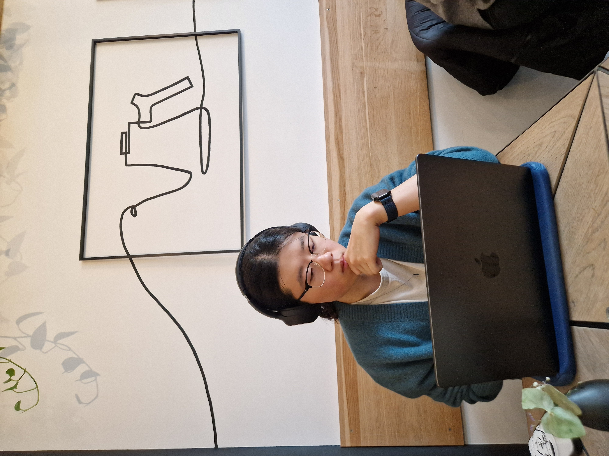

---js
const eleventyNavigation = {
	key: "About",
	order: 2
};
---
# About

	

I am a Machine Learning Engineer at [Hummingbird Diagnostics](https://www.hummingbird-diagnostics.com), where I research and apply AI and machine learning techniques to RNA sequences. 

I hold an M.Sc. in Data Science from the [University of Mannheim](https://www.uni-mannheim.de/en), where I also worked as a Research Assistant on projects in Computer Vision and Mechanistic Interpretability. 
Additionally, I was at [SAP](https://www.sap.com/) as a Data Scientist student, developing prototypes for computer vision application and supporting NLP projects.

Before pivoting fully to AI/ML, I worked at [Samsung Semiconductor Europe](https://semiconductor.samsung.com/emea/) as a Finance controller. I also hold an M.Sc. in Economics from the [Heidelberg University](https://www.uni-heidelberg.de/en).

Outside of work, I enjoy visual arts, cooking, and traveling.