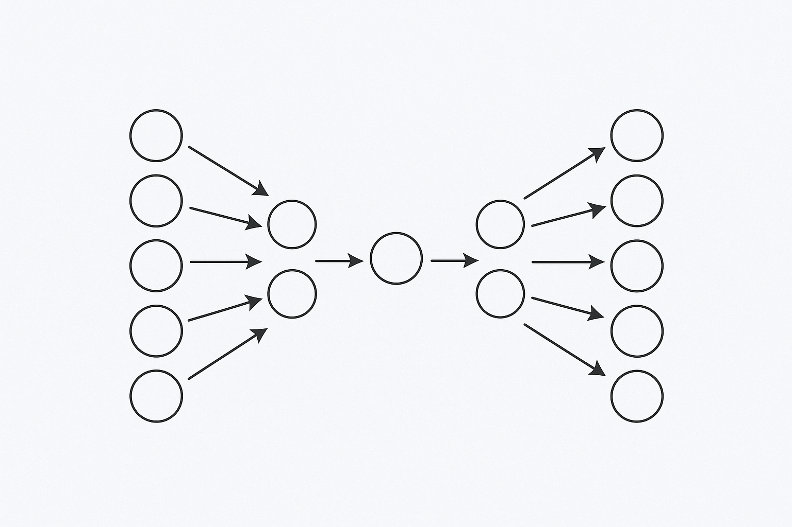
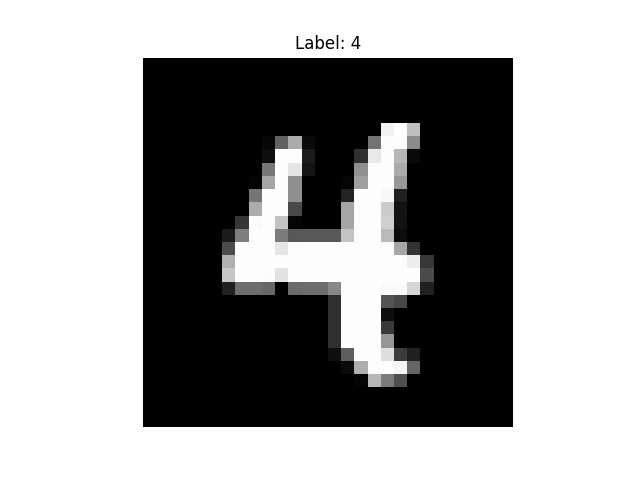
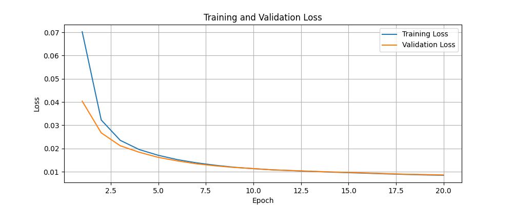
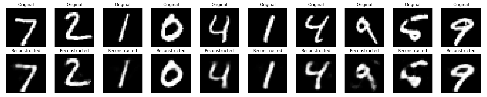
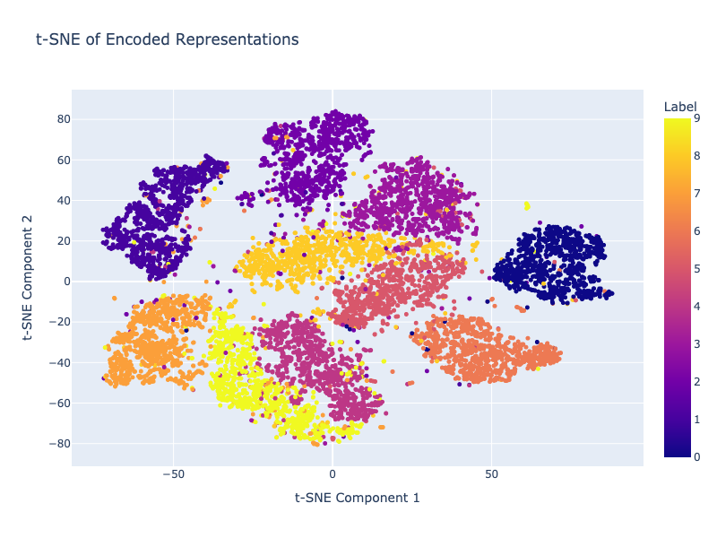

An **autoencoder** is a type of neural network designed to learn efficient data representations by itself, without supervision (hence, “auto” encoder). At its core, an autoencoder is trained to reconstruct its input: it compresses the data into a latent space (bottleneck), then attempts to generate the original input from this compressed form.

## Architecture

<div style="text-align: center;">
    
</div>

An autoencoder consists of two main components, Encoder and Decoder. In Encoder, the network takes the input data and put it into a latent space. As Encoder usually put this data into lower dimensional representation, the process is often called "compression". 
Decoder's job is to reconstruct the original input from this compressed data representation in the latent space. The network is trained to minimize difference between the input and its reconstructed output. The network is trained to minimize the difference between the input and its reconstruction, forcing it to learn meaningful compressed representations. 

## Key application

The idea of autoencoder may sound simple and easy, but autoencoders are very versatile and form backbone of many ML applications. Variational autoencoder, for example, combines the principles of autoencoder with probabilistic models, enabling the model to learn a continuous representation of the input and generate new data. Meta's [Masked autoencoder](https://arxiv.org/abs/2111.06377) demonstrates self-supervised learning for computer using autoencoder principle with masking patches. Also, [Sparse autoencoder](https://arxiv.org/abs/2309.08600) plays a crucial role in the field of interpretability research helping us understand the inner working of neural networks.

Autoencoders are used in various domains, including:

- Dimensionality reduction: Encoder learns to efficiently put input data onto lower dimension latent space than input space by compressing the input data. This is useful for simplifying data representation and improving efficiency of downstream tasks.
- Feature learning: Autoencoders learn compressed representation of data, which can be used as a set of learned features. These features are used in other downstream machine learning tasks such as classification and regression.
- Image denoising: autoencoder can be trained to reconstruct clean image from noisy input effectively as they tend to learn what’s most important from the input.
- Anomaly detection: As in image denoising, autoencoder learns to reconstruct what normal data patterns are. if certain data pattern deviates from this, they can flag these anomalies. This can be used in applications such as fraud detection.

## Hands on with MNIST

Let's walk through a simple autoencoder implementation using the MNIST dataset.

First, import the necessary libraries and set up hyperparameters and data transformation:

```python
import torch 
import torch.nn as nn
from torchvision import datasets, transforms

batch_size = 256
learning_rate = 1e-3
num_epoch = 20
encoding_dim = 32

transform = transforms.Compose([
    transforms.ToTensor(),
])
```

Next, download the MNIST dataset and create data loaders for training, validation, and testing:

```python
train_dataset = datasets.MNIST(root='./data',train=True, download=True, transform=transform)
train_size = int(0.8 * len(train_dataset))

train_dataset, val_dataset = torch.utils.data.random_split(train_dataset, [train_size, len(train_dataset) - train_size])

test_dataset = datasets.MNIST(root='./data',train=False, download=True, transform=transform)
train_loader = torch.utils.data.DataLoader(train_dataset, batch_size=batch_size, shuffle=True)
val_loader = torch.utils.data.DataLoader(val_dataset, batch_size=batch_size, shuffle=False)
test_loader = torch.utils.data.DataLoader(test_dataset, batch_size=batch_size, shuffle=False)
```
The MNIST dataset consists of 28×28 pixel images of handwritten digits, looking like below:

<div style="text-align: center;">
    
</div>

Then, define a simple autoencoder class with an encoder and decoder. Encoder compresses the 784(28x28) pixel 128 dimensional representation, and then encoding dimension which is 32 in this case. Decoder reconstructs the original image from the encoded representation ReLU activation is used in both encoder and decoder, and Sigmoid activation is used in the output layer to ensure the output values are between 0 and 1, which is suitable for image data normalized to this range.

```python
class Autoencoder(nn.Module):
    def __init__(self, encoding_dim):
        super(Autoencoder, self).__init__()
        self.encoder = nn.Sequential(
            nn.Linear(28 * 28, 128),
            nn.ReLU(),
            nn.Linear(128, encoding_dim)
        )
        self.decoder = nn.Sequential(
            nn.Linear(encoding_dim, 128),
            nn.ReLU(),
            nn.Linear(128, 28 * 28),
            nn.Sigmoid() 
        )

    def forward(self, x):
        x = x.view(-1, 28 * 28)
        encoded = self.encoder(x)
        decoded = self.decoder(encoded)
        return decoded.view(-1, 1, 28, 28), encoded
```

Now, initialize the model, set up the loss function and optimizer, and run the training and validation loops:

```python
model = Autoencoder(encoding_dim)
criterion = nn.MSELoss()
optimizer = torch.optim.Adam(model.parameters(), lr=learning_rate)

# Training and validation loops
train_losses = []
val_losses = []

for epoch in range(num_epoch):
    # Training
    model.train()
    train_loss = 0
    for data, _ in train_loader:
        data = data
        optimizer.zero_grad()
        reconstructed, _ = model(data)
        loss = criterion(reconstructed, data)
        loss.backward()
        optimizer.step()
        train_loss += loss.item()
    
    train_loss /= len(train_loader)
    train_losses.append(train_loss)
    
    # Validation
    model.eval()
    val_loss = 0
    with torch.no_grad():
        for data, _ in val_loader:
            data = data
            reconstructed, _ = model(data)
            loss = criterion(reconstructed, data)
            val_loss += loss.item()
    
    val_loss /= len(val_loader)
    val_losses.append(val_loss)
    
    print(f'Epoch [{epoch + 1}/{num_epoch}], Train Loss: {train_loss:.4f}, Val Loss: {val_loss:.4f}')

# Test 
model.eval()
with torch.no_grad():
    all_encoded = []
    all_labels = []
    test_loss = 0
    
    # Sample images for visualization
    n_samples = 10
    sample_images = []
    sample_reconstructed = []
    
    for i, (data, labels) in enumerate(test_loader):
        data = data
        reconstructed, encoded = model(data)
        
        # Collect loss
        loss = criterion(reconstructed, data)
        test_loss += loss.item()
        
        # Collect encodings and labels
        all_encoded.append(encoded.cpu())
        all_labels.append(labels)
        
        # Save first batch samples for visualization
        if i == 0:
            sample_images = data[:n_samples].cpu()
            sample_reconstructed = reconstructed[:n_samples].cpu()
    
    test_loss /= len(test_loader)
    print(f'Test Loss: {test_loss:.4f}')
    
    # Combine all encoded representations and labels
    all_encoded = torch.cat(all_encoded).numpy()
    all_labels = torch.cat(all_labels).numpy()
```

<div style="text-align: center;">
    
</div>


<div style="text-align: center;">
    
</div>

Training and validation losses are plotted to visualize the model is learning effectively. The original images and their reconstructed counterparts are displayed to see how well the autoencoder has learned to compress and reconstruct the data.

Finally, we visualize the encoded representations using t-SNE to see how well the model has learned to separate different classes in the latent space.


```python
import plotly.express as px
from sklearn.manifold import TSNE

tsne = TSNE(n_components=2, random_state=42)
encoded_2d_tsne = tsne.fit_transform(all_encoded)
fig = px.scatter(
    x=encoded_2d_tsne[:, 0],
    y=encoded_2d_tsne[:, 1],
    color=all_labels,
    labels={'x': 't-SNE Component 1', 'y': 't-SNE Component 2'},
    title='t-SNE of Encoded Representations'
)
fig.update_traces(marker=dict(size=5), selector=dict(mode='markers'))
fig.update_layout(height=600, width=800)
fig.show()
```


<div style="text-align: center;">
    
</div>

We can see that the encoded representations are quite well separated in the latent space even with a simple autoencoder architecture with quick training.
