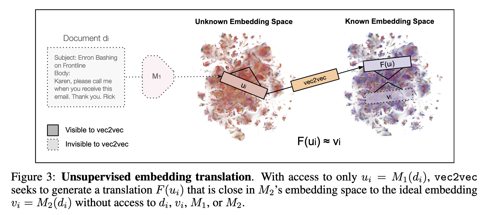
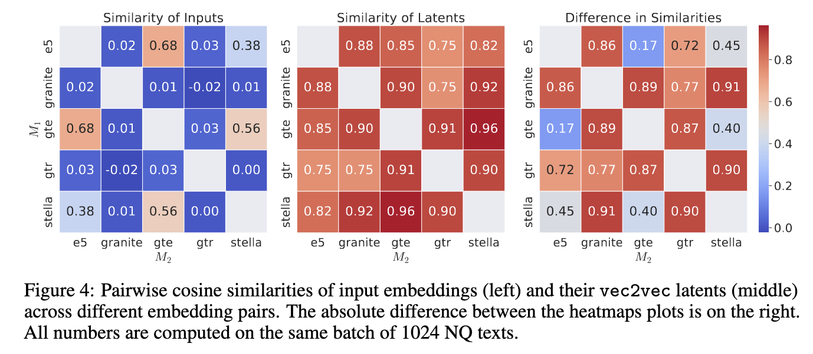

I recently read a paper that I found very interesting and believe it could have a significant impact on the field of machine learning, so I want to go through it here. Literature review sounds a bit too formal, so I’ll just think of it as reading it out loud. This paper is brought up to me in a recent dinner conversation with my former thesis supervisor. I was working as a research assistant supporting his research during my master’s degree and wrote thesis under his supervision. I really enjoyed researching with him and I am glad that we are still in touch. 

In this post, I will go through the paper [Harnessing the Universal Geometry of Embeddings](https://arxiv.org/abs/2505.12540). 

# Embeddings and the Platonic Representation Hypothesis
Neural networks are basically trained to produce embeddings, which are vector representations of seen data. A good, capable model will map data points with similar semantics close to each other in the embedding space. These embeddings will then be used for various downstream tasks. Lately, I’ve been thinking of neural networks as systems for building vector databases, where we retrieve semantics (using vector arithmetic, for instance) for downstream tasks. But the thing is, that each model builds its own embedding space, and these spaces are not directly comparable.

The authors of this paper reference the Platonic Representation Hypothesis, which conjectures that all image models of sufficient size have the same latent representation. When I first read about this hypothesis, I thought, yeah that totally makes sense. Because when we see and understand an image, what do we see? We see colors, shapes, textures and so on to distinguish what we see. So if computer vision models are seeing images in the same way, they should eventually be in the stage where they learn the same features....

However, I also recently came across an experiment involving models that do not use positional information—such as MLPs or autoencoders. In this setup, the models are trained to classify images from datasets like CIFAR-10 and MNIST. Since these tasks are very popular for first hands-on ML projects, we all know that models can learn to classify these images very well. But what's interesting is that the trained model can still classify the images correctly even when the input pixels are randomly shuffled, making the images unrecognizable to humans. This suggests that these models may learn to understand images in ways that are totally different from human perception. I should try this experiment myself to see how it works.

# Strong Platonic Representation Hypothesis
Returning to the paper, the authors extend the idea to text embeddings and propose a stronger version of this hypothesis which they call the Strong Platonic Representation Hypothesis: The universal latent struture of text representations can be learned and furthermore harnessed to translate representations from one space to another without any paired data or encoders.

# The vec2vec Method
The method proposed in this paper is called vec2vec, a name that overlaps with another paper [Vec2Vec: A Compact Neural Network Approach for  Transforming Text Embeddings with High Fidelity](https://arxiv.org/abs/2306.12689), which also addresses embedding translation. The vec2vec method in this paper aims to learn embedding space translation without any paired data or specialized encoders. As an unsupervised approach, it can be applied to any embedding space. While unsupervised translation has seen some success in computer vision, the authors note that since text embeddings lack spatial bias (unlike images), they use MLPs instead of CNNs. The training leverages GAN principles, along with additional constraints introduced to help the network learn meaningful mappings.

    

## Architecture
Vec2vec is having modular architecture:
- **Space-Specific Adapters**: Input adapters (A1, A2) transform embeddings from each model's specific space into a universal latent representation.
- **Shared Backbone Network**: A central component (T) extracts a common latent embedding.
- **Output Adapters**: These (B1, B2) translate the common latent embeddings back into the respective encoder-specific spaces.

In between two embedding spaces 1 and 2, authors introduce generator networks $F$ and $R$ where $F$ maps embeddings from one space to the common latent space and then maps into another space, $R$ maps from a embedding space to the common latent space and then maps back into the original space. Discriminator networks $D$ is intriduced to mirror the generator networks but without residual connections. 

## Optimization
Following the GAN principles, the optimization process involves training the generator and discriminator networks in an adversarial manner. The generator aims to produce embeddings that are indistinguishable from real embeddings in the target space, while the discriminator tries to differentiate between real and generated embeddings.

Additional contraints are introduced to preserve semantics and to help the generator to learn useful mapping. 
- **Reconstruction**: Ensures that an embedding, when passed through the latent space and back to its original space, accurately reconstructs itself.
$$
R(x) \sim x
$$
- **Cycle-Consistency**: Acts as an unsupervised proxy for supervised alignment, demanding that translating an embedding to another space and then back to the original results in minimal corruption.
$$
F_2(F_1(x)) \sim x \\
F_1(F_2(y)) \sim y
$$
- **Vector Space Preservation (VSP)**: This ensures "pairwise relationships (cosine similarities) between generated embeddings remain consistent under translation". VSP calculates the average of mean squared errors (squared L2 norm) of cosine similarities between original embeddings and their translated counterparts.

# Results and Implications
Vec2vec successfully learned a latent representation where embeddings from various models become closely aligned. Translated embeddings from different models exhibit high similarity, demonstrating its effectiveness.

    

Authors showed that vec2vec's capability extends to out of distribution data, such as medical records, and embedding space created from multimodal models like CLIP.

They also demonstrated serious security implications: vec2vec translations not only preserve geometric structure but also retain sufficient semantics to enable attribute inference and zero-shot inversion. The authors were able to extract sensitive disease information from patient records and partial content from corporate emails using only access to the embedding space. If this is universally applicable, it could pose a significant risk to data privacy and security. An adversary with access to an unknown embedding space could potentially extract sensitive information about the underlying data—without access to the original data or knowledge of the model architecture used to generate the embeddings.
