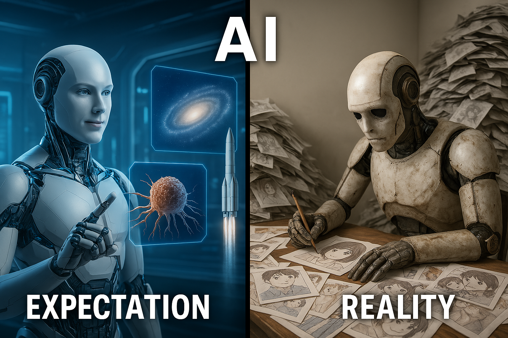

    

*KL divergence is a measure of how expectation diverges from reality.*

Kullback-Leiber divergence, often referred to as KL divergence, is a fundamental concept in machine learning that can initially seem confusing due to its somewhat intimidating name. However, understanding the intuition behind KL divergence is crucial as it plays a vital role in various areas like variational autoencoders, reinforcement learning, knowledge distillation, and many generative models. At its core, KL divergence measures how one probability distribution diverges from a second probability distribution.

KL divergence is closely related to the previously discussed concepts of entropy and cross entropy. Entropy measures the expected surprisal of event x under the true distribution $p(x)$, cross entropy measures the expected surprisal of event x with model’s predicted distribution $q(x)$ and weighting the estimated probabilities of event using the true distribution $p(x)$. While the model’s goal is to simulate the true distribution as close as possible but some discrepancy is almost always present. KL divergence quantifies this discrepancy,  measuring the "divergence" between these two informational values.

$$
\begin{align*}
D_{KL} (P || Q) &= \sum p(x) \log ({ p(x) \over q(x)}) \cr
&= \sum {p(x) \log p(x) - p(x) \log q(x)} \cr
&= -H(p) + H(p,q) \cr
&= \text{cross entropy} - \text{entropy}
\end{align*}
$$

## Understand KL divergence as MLE
As mentioned earlier, KL divergence measures the difference between two distributions. In many machine learning scenarios, our goal is to train a model whose predicted probability distribution $q(x;\theta)$ (parameterized by $\theta$) is as close as possible to the true underlying distribution $p(x)$ of the data. Minimizing this difference is crucial for building effective models.

Looking at the formula above, the true distribution is given and therefore the entropy $H(P)$ is a constant with respect to our model parameters $\theta$. This makes our goal of minimizing KL divergence equivalent to finding model parameter $\theta$ that minimizes cross entropy:

$$
H(p,q) = - \sum_x p(x)\log q(x;\theta)
$$

Now, let's see why minimizing this cross entropy is equivalent to performing maximum likelihood estimation.

As previously discussed in <a href="../likelihood-mle/likelihood-mle.md">Likelihood and Maximum Likelihood Estimation</a>, in MLE, our goal is to find the parameter $\theta$ of a model distribution $q(x;\theta)$ that best explains a set of observed data points $x_1, x_2,...,x_n$, assumining these data points are independetly and identically distributed from the true distribution $p(x)$. The log-likelihood of observed data with the parameter $\theta$ is:

$$
\log L(\theta | x_1,...,x_n) = \sum_{i=1}^n \log q(x_i;\theta)
$$

In practice, we often don't know the true distribution $p(x)$. However, given a set of observed data points, we can consider the empirical distribution of $\hat{p}(x)$, whcih assigns a probability of $1/n$ to each observed data point. The cross entropy between this empirical distribution $\hat{p}(x)$ and the model distribution $q(x;\theta)$ is:

$$
\begin{align*}
H(\hat{p},q) &= - \sum_x \hat{p}(x)\log q(x;\theta) \cr
&=-{1\over n} \sum_{i=1}^n \log q(x;\theta)
\end{align*}
$$

This shows that minimizing the cross-entropy between the empirical distribution of our observed data and our model's distribution is equivalent to maximizing the average log-likelihood of the data under the model. Therefore, training a model by minimizing the KL divergence between the empirical data distribution and the model distribution is fundamentally the same as performing maximum likelihood estimation.

## Reference
<a href="https://en.wikipedia.org/wiki/Kullback–Leibler_divergence">Kullback-Leibler divergence wikipedia
</a>
