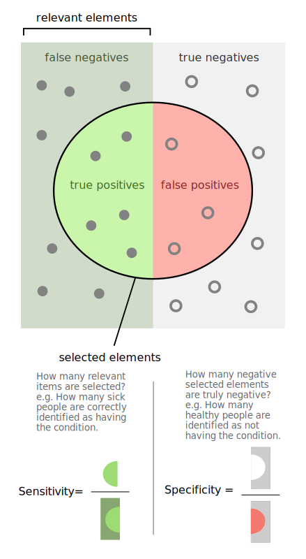

During my study and research, I mostly encountered **accuracy**, **precision**, **recall**, and **F1 score** as performance metrics for machine learning tasks. After I started working in the field of biotech, I quickly realized that people in biology use different metrics. It always takes me some time to get used to these definitions, so I’m writing this to go over them again in the hope that it will stick in my brain longer and more clearly.

**Accuracy** is the most straightforward metric; it measures the proportion of correct predictions among the total number. **Precision** and **recall** are two common performance metrics used in machine learning. Precision quantifies, among the data predicted as positive, how much is actually correct. For example, in a task distinguishing cats and dogs, precision tells us how many of the photos predicted as “dog” by the model are actually dogs. Recall quantifies, among all positives in the data(labeled as dog), how much the model successfully retrieves(predicted as dog). In the same example, recall shows what fraction of all actual dog photos the model correctly predicts as “dog.”

If every positive prediction is correct, precision is 1. If every actual truth is found, recall is 1. Each metric has cases where it is more important. For example, precision is especially crucial in the justice system. If a judge decides to send someone to jail because they are believed guilty, the harm of sending an innocent person to jail is extremely high. That’s why justice systems tend to be conservative in convicting, even at the cost of letting some guilty people go free (sacrificing recall).

**When is recall more important than precision?** Think of a fire alarm. It’s not uncommon to hear a fire alarm and have to evacuate a building, only to find out there was no real fire (a false positive). However, if there is an actual fire and the alarm fails to go off, the consequences can be far worse than the inconvenience of a false alarm. So, these systems are designed to maximize recall, even if that means tolerating a higher rate of false positives.

Because precision and recall have an inverse relationship, they are often reported together, or combined using the **F1 score** or the **Matthews Correlation Coefficient (MCC)**.

**F1 score** is simply the harmonic mean of precision and recall.

$$
F1 = \left( \frac{1}{\frac{1}{\text{Precision}} + \frac{1}{\text{Recall}}} \cdot 2 \right) = \frac{2 \times \text{Precision} \times \text{Recall}}{\text{Precision} + \text{Recall}}
$$

The **Matthews Correlation Coefficient (MCC)**, like the F1 score, is a single-number metric for binary classification, but it captures different aspects of performance.

MCC is defined as:

$$
MCC = \frac{TP \times TN - FP \times FN}{\sqrt{(TP+FP)(TP+FN)(TN+FP)(TN+FN)}} \in [-1, 1]
$$

The F1 score uses TP, FP, and FN, focusing more on positive cases (TN is not considered). MCC, in contrast, uses all four confusion matrix elements and is particularly useful for imbalanced data, as it avoids misleadingly high scores driven by the majority class.

By the way, MCC seems to be the name commonly used in machine learning. According to Wikipedia, in statistics, it’s known as the **phi coefficient** or the **mean square contingency coefficient**. (Can we just use one name everywhere? 🥲)

    

After getting used to these metrics, I entered the field of bioinformatics—where suddenly, nobody talks about precision and recall; instead, they use **sensitivity** and **specificity**! 

Sensitivity is actually identical to recall, just a different name 🤷🏻‍♂️. What is specificity? Specificity is also called the True Negative Rate:

$$
\text{Specificity} = \frac{TN}{TN + FP}
$$

It quantifies, among all actual negatives, what fraction is correctly predicted as negative.

Just as in the fire alarm example, sensitivity becomes even more important in medical cases such as disease screening—we don’t want to miss any real cases.

While precision and specificity both penalize false positives, they answer slightly different questions. Specificity focuses on minimizing false positives relative to all negatives, while precision minimizes false positives relative to positive predictions. In the justice system example, precision asks: “Among those jailed, how many were truly guilty?” Specificity asks: “Among all innocents, how many did the system correctly set free?”

    

## Reference
<a href="https://en.wikipedia.org/wiki/Precision_and_recall">Precision and Recall Wikipedia</a>

<a href="https://en.wikipedia.org/wiki/Sensitivity_and_specificity">Sensitivity and Specificity Wikipedia</a>