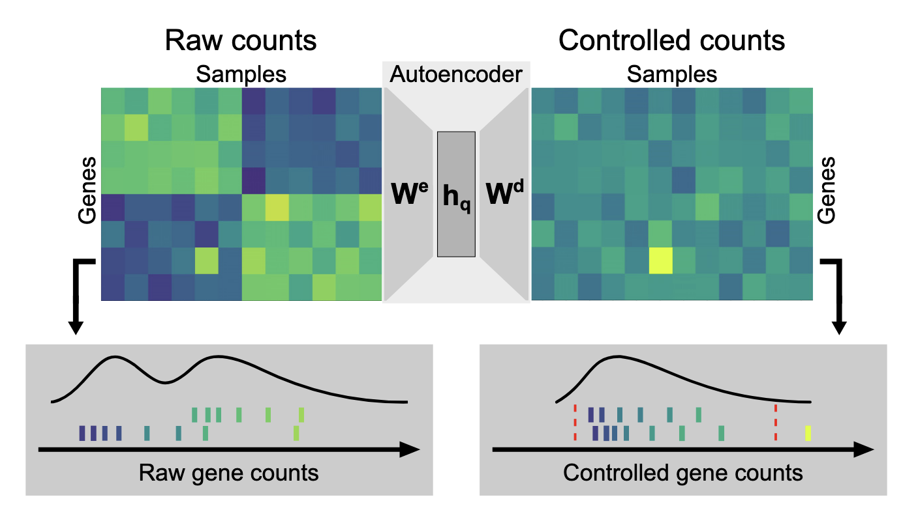

    

These days, I’ve been working on a project to clean up RNA-seq expression data, especially trying to reduce the effects of technical variations. After about a year of exploring biological datasets, I’ve learned one thing for sure: biodata is messy.

When I worked with image data, problems in the data were often obvious. If something was wrong, I could just see it or the whole thing simply wouldn’t work. In biology, it’s a different story. The signal we want is buried under layers of variation—some of it real biology, like differences in sex, age, tissue type, or disease, and some of it pure noise, like how the sample was handled or whether there was unwanted hemolysis. All of this gets condensed into a single number: the expression level.

So when an expression level shoots high or drops low, how can we tell if it’s a genuine biological anomaly or just a byproduct of all that mess? What’s worse, we have no way of knowing the true underlying value—the “ground truth.”

This is where I came across this [paper](https://pmc.ncbi.nlm.nih.gov/articles/PMC6288422/). I’ve been increasingly interested in how we can mitigate technical variation and get closer to the actual truth we want to see in biological data. Because, at the end of the day, data is the foundation of any ML application—and as we all know, garbage in, garbage out.
The authors introduced an outlier detection method that gave me several aha moments in terms of theoretical soundness. First, they pointed out that many previous outlier detection tools skipped formal statistical testing and relied on arbitrary thresholds. This absolutely applies to my work too, and it’s something that has frustrated me. Second, many methods require manual confounder corrections, which I’d like to improve someday by using machine learning in a more automated but still robust way.

The overall implementation of the autoencoder seems straightforward. It starts with raw counts $k_{ij}$ for gene $j$ in sample $i$. These counts are normalized by a size factor $s_i$ to correct for sequencing depth, then log-transformed:

$$
x_{ij} = \log \left( \frac{k_{ij} + 1}{s_i} \right)
$$

Next comes gene-wise centering, where the mean expression for each gene across all samples, $\bar{x}_j$, is subtracted:

$$\tilde x_{ij} = x_{ij} - \bar{x}_j$$

This strips away each gene’s baseline, leaving only the variation.

The autoencoder takes $\tilde{x}$ as input and learns to perform maximum likelihood estimation for an assumed negative binomial distribution. The output of the autoencoder, $y$, is defined as:
$$y_{ij} = h_i W_d + b_j$$

Here, $h_i$ is the encoded version of $\tilde{x}_i$ from the encoder, and the bias term $b_j$ is initialized as the mean of the log-transformed, size-factor-normalized counts:

$$\bar x_j = \mathrm{mean} \left( \log \left( \frac{k_{ij} + 1}{s_i} \right) \right)$$

This puzzled me for some time because I was stuck on the idea of the autoencoder reconstructing its original input, as in most common use cases. I wondered how the output could be the full $y$ and not just the gene-wise-centered variation $\tilde{y}$, and in that case, I thought the bias term $b$ might simply converge toward zero so the autoencoder would reconstruct $\tilde{x}$. After some rereading and scribbling, I realized I needed to look at it through the lens of maximum likelihood estimation and stop thinking about it as plain reconstruction.

In the supplemental materials, the authors show how the negative log-likelihood for the assumed negative binomial distribution is derived and used for optimization. Even so, I still find the notation $c_{ij} = AE(k_{ij})$ a bit confusing—it’s more like: first transform $k \rightarrow x$, then $y = AE(x)$, and finally transform back to the original scale $y \rightarrow c$.

Not blindly assuming a Gaussian distribution is something I’ve learned in the field of biology. The choice of loss function here—and the decision to use a distribution that closely matches the data—touches the core of all deep learning methods. I think that’s worth a separate post entirely.

In the Kremer dataset, the model successfully recalled all six pathogenic events that had been previously validated, including CLPP and MCOLN1, which were originally reported only as splice defects but here also showed loss of expression. Compared to methods like PCA and PEER, which missed some of these events and flagged more irrelevant outliers, OUTRIDER demonstrated higher precision and recall. In the GTEx dataset, expression outliers identified by the model were more enriched for rare variants with predicted moderate or high impact, suggesting that its calls are more biologically relevant. Notably, it achieved these results with fewer samples—around 60 were sufficient to recover most known pathogenic events—whereas PCA and PEER required at least 80. This combination of statistical rigor, improved accuracy, and reduced data requirements highlights OUTRIDER’s advantage for both research and diagnostic applications.

I’m excited to explore new ways to make RNA-seq data cleaner, potentially by incorporating generative models. The cleaner the data at its source, the better chance we give downstream analyses—and even clinical diagnostics—of uncovering real biological signals.