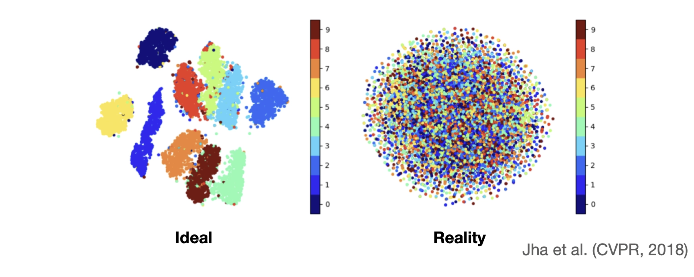

In machine learning for transcriptomics, the Variational Autoencoder (VAE) has become one of the central modeling ideas, as seen in the scVI family. Since we already covered the plain autoencoder before, it seems like a good idea to take a look at variational autoencoders.

An autoencoder has two parts. The **encoder** compresses the input into a smaller latent representation, and the **decoder** tries to reconstruct the original input from that compressed code. The important point is that in a standard autoencoder, the encoder maps each input to a **single deterministic point** in latent space. This encoder–decoder architecture does not change in a variational autoencoder.

However, a VAE is different in how it encodes (compresses) data into latent space. Instead of mapping an input to one point, it maps the input to a **probability distribution over latent space**. So rather than saying, “this sample lives exactly here,” the encoder says, “this sample lives somewhere around here, with this amount of uncertainty.”

That one change has major consequences. It makes the latent space more continuous, more structured, and much easier to sample from. A plain autoencoder can learn a useful compression, but a VAE learns something closer to a **generative map** of the data.

That one change has major consequences. It makes the latent space more continuous, more structured, and much easier to sample from. A plain autoencoder can learn a useful compression, but a VAE learns something closer to a **generative map** of the data.

Let us introduce the standard notation.

We write the observed data as $x$, and the hidden latent variable as $z$. For example, in transcriptomics, $x$ could be a gene expression profile. The latent variable $z$ is the compact hidden summary that explains the sample.

The VAE assumes that data are generated in two steps.

First, we sample a latent variable from a simple prior distribution:
$$
z \sim p(z)
$$
Usually, this prior is chosen to be a standard normal distribution:
$$
p(z) = \mathcal{N}(0, I)
$$
Then, given $z$, we generate the observed data through the decoder:
$$
x \sim p_\theta(x \mid z)
$$
This distribution $p_\theta(x \mid z)$ is called the **likelihood**. It describes how likely the observed data $x$ is given the latent variable $z$. In image models, this may be Gaussian or Bernoulli. In transcriptomics, especially count-based data such as single-cell RNA-seq, it is often more appropriate to use a **Negative Binomial** or **zero-inflated Negative Binomial** likelihood.

So the generative story is simple: sample $z$ from a prior, then sample $x$ from a decoder conditioned on $z$.

## **What are we ultimately trying to model?**

At the highest level, what we want is to model the probability of the data itself:
$$
p_\theta(x)
$$
If we can model $p_\theta(x)$ well, then we can generate new realistic samples, detect unusual samples, and learn meaningful latent representations that capture important structure in the data.

We can write $p_\theta(x)$ by marginalizing over all possible values of $z$:
$$
p_\theta(x) = \int p_\theta(x \mid z)\, p(z)\, dz
$$
At this point, the key ingredients of the VAE appear naturally:

the **prior** $p(z)$, the **likelihood** $p_\theta(x \mid z)$, and the **posterior** $p_\theta(z \mid x)$.

The posterior tells us which latent values $z$ are plausible given an observed data point $x$. Unfortunately, the true posterior $p_\theta(z \mid x)$ is usually intractable.

The VAE solves this by introducing an **approximate posterior**:
$$
q_\phi(z \mid x)
$$
This is what the encoder learns. Instead of trying to compute the exact posterior directly, we learn a tractable approximation to it.

That is the “variational” part of the Variational Autoencoder.

## **ELBO**

Since directly maximizing $\log p_\theta(x)$ is difficult, we derive a lower bound that we can optimize.

Start with:
$$
\log p_\theta(x)
= \log \int p_\theta(x\mid z)p(z)\,dz
$$
Now multiply and divide inside the integral by $q_\phi(z\mid x)$:

$$
\log p_\theta(x)
= \log \int q_\phi(z\mid x)\,
\frac{p_\theta(x\mid z)p(z)}{q_\phi(z\mid x)}\,dz
$$

This can be written as:

$$
\log p_\theta(x)
= \log \mathbb{E}_{q_\phi(z\mid x)}
\left[
\frac{p_\theta(x\mid z)p(z)}{q_\phi(z\mid x)}
\right]
$$

Applying Jensen’s inequality:

$$
\log p_\theta(x)
\ge
\mathbb{E}_{q_\phi(z\mid x)}
\left[
\log \frac{p_\theta(x\mid z)p(z)}{q_\phi(z\mid x)}
\right]
$$

This lower bound is the **Evidence Lower Bound**, or **ELBO**.

We get:

$$
\mathcal{L}_{\text{ELBO}}(x)
=
\mathbb{E}_{q_\phi(z \mid x)}[\log p_\theta(x \mid z)]
-
D_{\mathrm{KL}}(q_\phi(z \mid x)\,\|\,p(z))
$$

The first term is the **reconstruction term**, and the second is the **KL divergence term** that regularizes the latent space.

## **The reparameterization trick**

At this point, one technical problem appears.

Neural networks are trained by gradient descent. But if the encoder outputs a distribution and we sample from it, how can gradients flow through that random sampling step?

Suppose the encoder produces $\mu(x)$ and $\sigma^2(x)$, and then we sample
$$
z \sim \mathcal{N}(\mu(x), \sigma^2(x))
$$
Directly sampling like this breaks gradient flow. The model would contain a random operation that is not straightforward to differentiate through.

The reparameterization trick solves this by rewriting the sample in an equivalent form:
$$
z = \mu(x) + \sigma(x)\epsilon,\qquad \epsilon \sim \mathcal{N}(0, I)
$$
This looks simple, but it is one of the key ideas that made VAEs practical.

Instead of sampling $z$ directly, we sample a noise variable $\epsilon$ from a fixed standard normal distribution. We then transform that noise using the encoder outputs $\mu(x)$ and $\sigma(x)$.

This separates the random part from the learned part. The randomness lives in $\epsilon$, while the transformation from $\epsilon$ to $z$ is differentiable. That means gradients can flow through $\mu(x)$ and $\sigma(x)$, and the whole model can be trained end-to-end using backpropagation.

## **Why VAEs can generate new data**

A plain autoencoder can compress and reconstruct, but it does not necessarily learn a latent space that is easy to sample from. If you pick a random point in its latent space, there is no guarantee the decoder will produce a meaningful output.

A VAE is different because its latent space is explicitly regularized toward a known prior, typically a standard normal distribution. That means once training is complete, we can sample a fresh latent vector:
$$
z \sim \mathcal{N}(0, I)
$$
and pass it through the decoder to generate a new synthetic sample.

This is the key generative advantage of the VAE.

That is why VAEs became so important for representation learning and generative modeling.

## **How to implement a simple VAE**

Now that the ideas are in place, the implementation becomes much less mysterious.

A minimal VAE has three core parts. The encoder outputs the latent mean and log-variance. The reparameterization step samples a latent vector in a differentiable way. The decoder maps that latent vector back to the data space.

Here is a simple PyTorch implementation of that idea:
```
import torch
import torch.nn as nn

class VAE(nn.Module):
    def __init__(self, input_dim: int, latent_dim: int, hidden_dims: list[int]):
        super().__init__()
        self.input_dim = input_dim
        self.latent_dim = latent_dim

        encoder_layers = []
        current_dim = input_dim
        for h in hidden_dims:
            encoder_layers.extend([
                nn.Linear(current_dim, h),
                nn.ReLU(),
                nn.Dropout(0.2)
            ])
            current_dim = h

        self.encoder = nn.Sequential(*encoder_layers)
        self.fc_mu = nn.Linear(current_dim, latent_dim)
        self.fc_logvar = nn.Linear(current_dim, latent_dim)

        decoder_layers = []
        current_dim = latent_dim
        for h in reversed(hidden_dims):
            decoder_layers.extend([
                nn.Linear(current_dim, h),
                nn.ReLU(),
                nn.Dropout(0.2)
            ])
            current_dim = h

        self.decoder = nn.Sequential(*decoder_layers)
        self.fc_out = nn.Linear(current_dim, input_dim)

    def encode(self, x: torch.Tensor):
        h = self.encoder(x)
        mu_z = self.fc_mu(h)
        logvar_z = self.fc_logvar(h)
        return mu_z, logvar_z

    def reparameterize(self, mu_z: torch.Tensor, logvar_z: torch.Tensor):
        std = torch.exp(0.5 * logvar_z)
        eps = torch.randn_like(std)
        return mu_z + eps * std

    def decode(self, z):
        h = self.decoder(z)
        x_recon = self.fc_out(h)
        return x_recon

    def forward(self, x):
        mu_z, logvar_z = self.encode(x)
        z = self.reparameterize(mu_z, logvar_z)
        x_recon = self.decode(z)
        return x_recon, mu_z, logvar_z
```
This code intentionally stays simple. It assumes a Gaussian-style reconstruction setup and leaves out details such as the exact loss function and likelihood choice, but the core mechanics are all there.

The encoder learns the parameters of the approximate posterior. The reparameterization trick makes latent sampling differentiable. The decoder reconstructs from the sampled latent code. Together, these components implement the central idea of a VAE.

<div style="text-align: center;">
    
</div>

It all sounded great, and I implemented it for a project. But when I looked into the latent space, something was wrong. I couldn’t see any meaningful separation; instead, I saw a chaotic mix of all classes without any clear pattern. I was quite confused when I first encountered this, but later learned that it is something called **posterior collapse**.

Formally, this happens when the approximate posterior $q_\phi(z \mid x)$ becomes very close to the prior $p(z)$. When that happens, the latent variable $z$ stops carrying meaningful information about the input.

What makes this tricky is that the model may still *seem* to work. The loss decreases, reconstructions may look reasonable, and training does not crash. But internally, the latent space has become uninformative.

A useful way to think about this is in terms of communication. The encoder is trying to send information about the input through the latent variable $z$, and the decoder is supposed to use that information to reconstruct the data. Posterior collapse happens when the decoder becomes so good that it stops listening. The encoder is still writing a message, but the decoder ignores it and reconstructs the input on its own.

Once that happens, the KL term is minimized by simply matching the prior, and the latent variables effectively carry no signal.

## **Why does posterior collapse happen?**

There is no single cause, but several factors tend to contribute.

One of the most common reasons is that the **decoder is too powerful**. If the decoder can reconstruct the data well without relying on $z$, then the easiest way to minimize the loss is to ignore the latent variable entirely. The model learns that it can achieve good reconstruction while keeping the KL term small, and collapse naturally follows.

Another factor is **training dynamics**. Early in training, the encoder may not yet produce meaningful latent representations. At that stage, the model may discover that ignoring $z$ leads to faster optimization. Once it settles into that regime, it can be difficult to recover and start using the latent space again.

There is also a more subtle point: collapse is not always just “the KL term being too strong.” In some cases, the objective itself admits solutions where the latent variable is unused, and optimization gets stuck there. So this is not only a modeling issue but also an optimization issue.

In conditional settings, there is an additional twist. If the model is given extra information, such as labels or conditions, the decoder may rely heavily on that signal instead of the latent variable. In that case, the latent space can again become redundant.

## **What helps in practice?**

Because posterior collapse is so common, a number of practical techniques have emerged.

One straightforward approach is to **limit the power of the decoder**. If the decoder is too expressive, it can reconstruct the data without relying on the latent variable. Making the decoder smaller or simpler can force it to depend more on the latent representation.

One widely used idea is **KL annealing**. Instead of applying the full KL penalty from the beginning, the model starts with a small KL weight and gradually increases it during training. This allows the model to first learn to use the latent variables before being strongly pushed toward the prior.

Another approach is **free bits**, which enforces a minimum amount of information in each latent dimension. Instead of allowing the KL term to collapse to zero, the model is encouraged to use at least a small amount of capacity in the latent space.

From an architectural perspective, **skip connections** can also help. By giving the latent variable a more direct path into the decoder, the model is less able to ignore it. In simple terms, the latent code gets a louder voice.

The common theme behind all of these techniques is the same: they encourage the model to actually use its latent variables, rather than finding a shortcut that bypasses them.

## **Extending the idea: Conditional VAEs**

So far, we have discussed VAEs as models that learn latent representations of data. Another important extension is learning under conditions!! This is where **Conditional VAEs (CVAEs)** come in.

You can think of this as learning with context. The model learns not only what the data looks like, but also how it changes under different conditions.

In a CVAE, we introduce an additional variable $c$, which represents some known condition. This could be a class label, a batch identifier, or a treatment condition.

Instead of modelling
$$
p(x)
$$
we now model
$$
p(x \mid c)
$$
The encoder and decoder are modified accordingly:
$$
q_\phi(z \mid x, c), \quad p_\theta(x \mid z, c)
$$
In plain terms, the model is no longer trying to explain the data in isolation. It is trying to explain the data **given some context**.

This small change is extremely powerful.

A standard VAE learns a latent space that captures all sources of variation in the data. A CVAE allows us to **separate known factors from unknown ones**. The condition $c$ explains the variation we already understand, while the latent variable $z$ captures the remaining structure.

In transcriptomics, this is particularly useful. For example, if we know that some samples are affected by a technical artifact, we can condition on that variable. The model can then learn to separate biological signal from technical noise.

At inference time, this enables a very useful operation: we can take a sample, encode it into latent space, and then decode it under a different condition.

In effect, we can ask:

“What would this sample look like if this condition were different?”